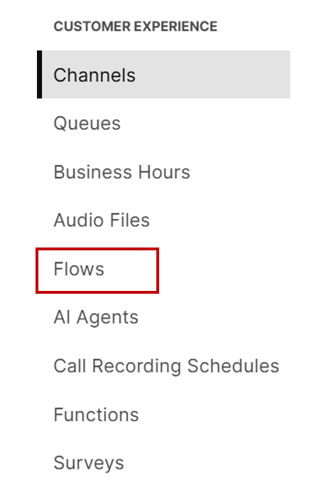
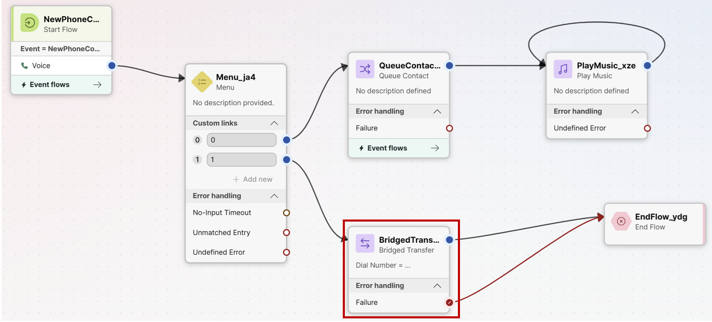
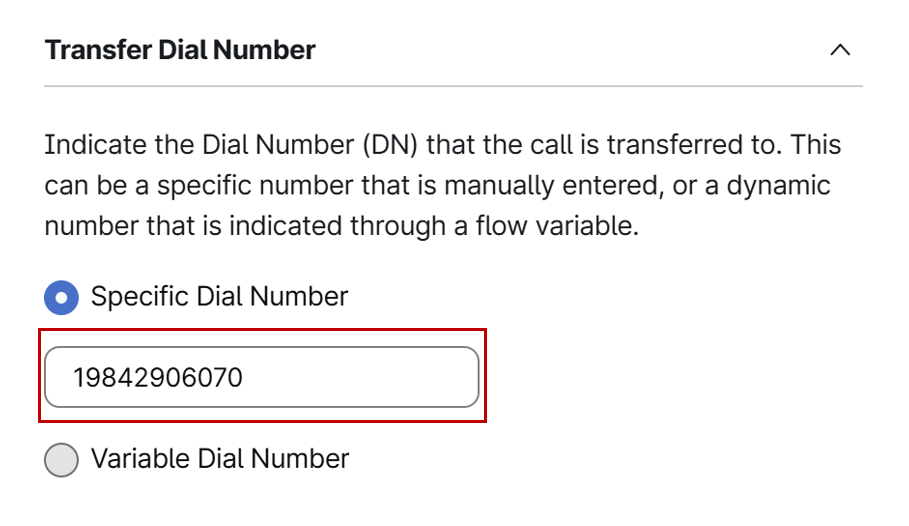
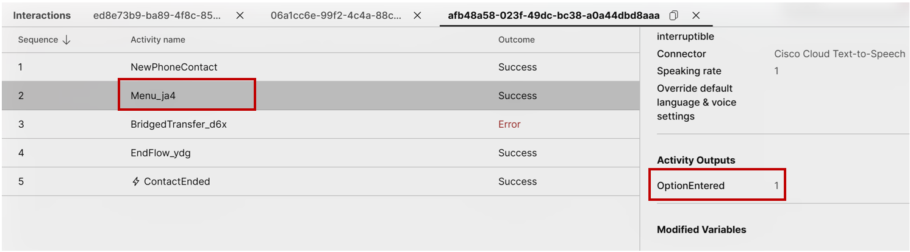
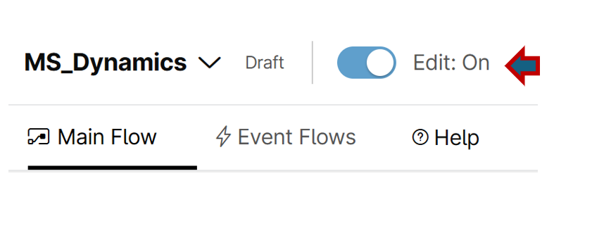
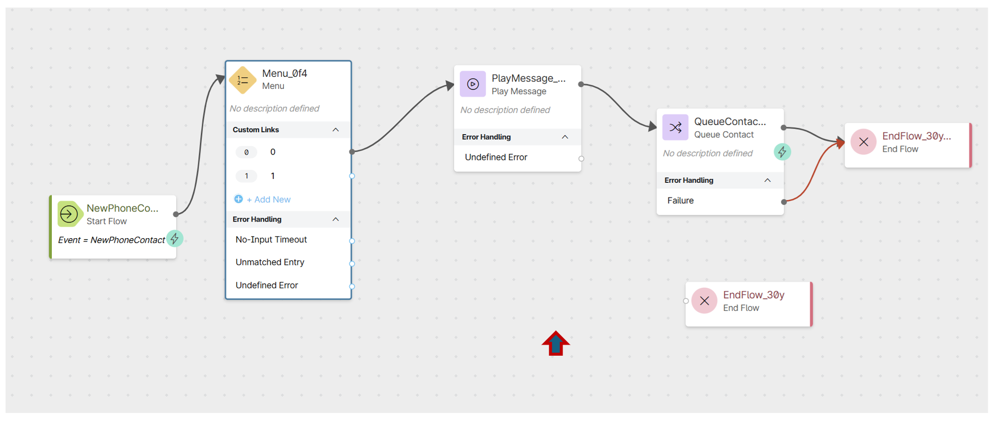
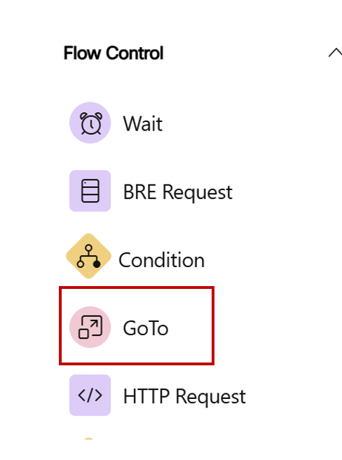
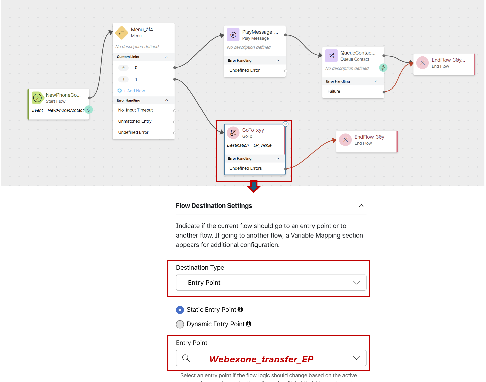
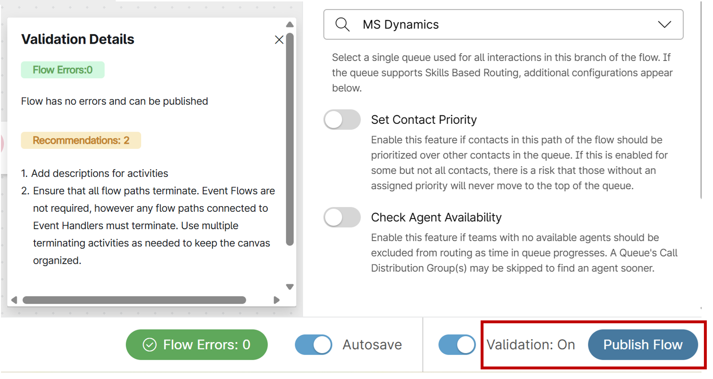
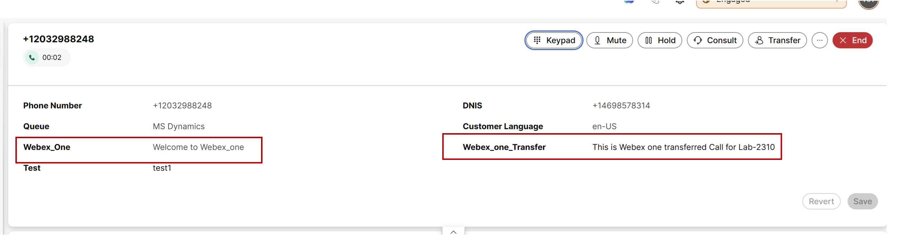

# Lab 2 - Seamless Call Transfer & Preserving flow Variables

Please use the following credentials to connect to Control Hub and configure Webex Contact Center:

| <!-- -->         | <!-- -->         |
| ---------------- | ---------------- |
| `Control Hub URL`            | <a href="https://admin.webex.com" target="_blank">https://admin.webex.com</a> |
| `Username`       | labuser**ID**@wx1.wbx.ai  _(where **ID** is your assigned pod number; this ID will be provided by your proctor)_ |
| `Password`       | webexONE1! |

## Objective 

The objective of this exercise is to fix a call flow that fails during a transfer.

Current Call Flow & Problem is as follows 

      - First Leg: A customer calls and selects Option 1, which transfers the call to another department.
      - Disconnect: This transfer forces the call to leave the system and re-enter through a new entry point, creating a separate call leg.
      - Second Leg: In this new flow, the customer must select the User ID option to reach the correct team and agent.
      - Core Issue: The transfer currently fails. The customer experiences dead air, and the call drops.

The task is to Update the flow so the call transfers seamlessly to the correct destination while preserving and passing all original flow variables to the receiving agent.

## Section 1 : Experience the Issue

- Ensure the agent is logged into the agent desktop and set to an Available status.

- Call the same entry point number configured in Lab 1 for inbound calls, then select Option 1.

- Notice that you experience **dead air** and the call remains stuck in this state.

- Disconnect the call.

- **The Problem**: Based on the business logic, the call should transfer to another department and play the menu defined for that new department.

## Section 2 : Inspect the Flow

- To understand why this issue is occurring, start by inspecting the main flow.

- In Control Hub, go to the Customer Experience section, select Flows, and search for your mapped flow: WebexOne_Flow_[num].
  
      { width="200" }

- Locate the Menu node for Option 1 and note that it routes directly to a "**Bridge Transfer**" node.

      { width="700" }

- Select the Bridge Transfer node. Observe that it transfers the call to **19842906070**, which maps to another flow named **WebexOne_Flow_Transfer**.

      { width="500" }

- The phone number and format are correct, so lets use the Debug feature to investigate further.

- Click Debug and review the log for the most recent call.

- Confirm in the debug view that the call successfully passed through the Menu node when Option 1 was pressed.

      { width="500" }

- Select the Bridge Transfer node. The execution outcome shows an error, and the Activity Output panel displays the cause: **UNSUPPORTED_DN**
  
- This error represents the core of the problem, but why ? 

      - Platform Restriction: Bridge Transfer nodes in Webex Contact Center Flow Designer cannot transfer calls to a Dialed Number (DN) that is already provisioned as an Entry Point Dialed Number (EP-DN).
      - Routing Loop Prevention: Bridge Transfer is intended for offloading media to external destinations or 3rd-party IVRs via SIP trunks.
      - The Loop: Transferring a call via Bridge Transfer to an EP-DN attempts to loop the call back into Webex Contact Center as a new inbound trigger, causing the Flow Designer engine to block the call with the UNSUPPORTED_DN error code.
  
## Section 3 : Correct the Flow 

- To rectify this, we need a node that handles internal transfers more effectively. 

- The Flow Designer provides a "GoTo Node" specifically for this use case.

!!! Note 
      A GoTo Node is used to seamlessly transfer a call to another flow within the same system, preserving variables. 
      A Transfer node is used to transfer a call to an external number.

- To replace the Bridge Transfer node, first enable the edit mode of the flow designer.

      { width="500" }

- Delete the Bridge Transfer node by selecting it and pressing the delete key.

      { width="700" }

- From the Flow Control section, drag a "GoTo Node" onto the canvas.

      { width="200" }

- In the GoTo Node's properties, select "Entry point" as the destination type and map it to "**WebexOne_Transfer_EP**"

      { width="700" }

- Connect the Menu node's Option 1 output to the GoTo Node and the "undefined" error output to the "End of the flow" node, as shown in the screenshot above 

- Toggle "Validation" to "On" to ensure there are no validation errors, and then publish the flow.

      { width="500" }

## Section 4 : Verify the Solution

- Ensure that the agent is logged into the desktop and has an "Available" status.

- Call your provided number from your cell phone again and press Option 1. 

- You should hear no ringback, but instead, be directly presented with the menu option to enter your user ID.

- This resolves the transfer problem of solution rejecting this type of unsupprted internal transfer.

- Once you provide the user ID, the agent should receive the call.

- After the call is accepted, you should now see the two variables defined in the first flow on the agent desktop.

      { width="900" }

- This confirms that the variables are also carried over via this node when  call is transfered to another entry point.

**Congratulations !!** on successfully completing this exercise! 

You've learned how to perform seamless internal transfers within entry points and now understand the crucial difference between a Bridge Transfer and a GoTo Node.

