# Lab 3 -  Set Up Outdial Calls in WxCC

Please use the following credentials to connect to Control Hub and configure Webex Contact Center:

| <!-- -->         | <!-- -->         |
| ---------------- | ---------------- |
| `Control Hub URL`            | <a href="https://admin.webex.com" target="_blank">https://admin.webex.com</a> |
| `Username`       | labuser**ID**@wx1.wbx.ai _(where **ID** is your assigned pod number; this ID will be provided by your proctor)_ |
| `Password`       | webexONE1! |

## Objective 

In this lab exercise, 

## Section 1 : Review Skills, Profiles, and Agent Entitlements 

**Verify Pre-created Skills:**

- Log into [Webex Control Hub](https://admin.webex.com) with the provided credentials.
  
-  From the left navigation sidebar, go to **Services** and select **Contact Center**.

- Navigate to **Customer Experience** > **Skill Management**.
  
- On the **Skills** tab, locate the following pre-created skills:
	* `WebexOne__Spanish_Fluency`
	* `WebexOne_VIP_Support`

- Review each skill's parameters against the baseline configuration table below:

| Skill Name | Expected Skill Type |
| --- | --- |
| `WebexOne__Spanish_Fluency` | Proficiency |
| `WebexOne_VIP_Support` | Boolean |

**Verify the Skill Profile:**

A **Skill Profile** acts as a container grouping multiple skills together so you can assign them to agents at once.

- In **Contact Center**, go to **User Management** > **Skill Profile**.

- Locate `WebexOne_Spanish_Specialist` in the **Skill Profiles** list.

- Select its row to open the configuration details panel.

- Under the **Active Skills** section, confirm that the settings match the table below:

| Skill Name | Skill Type | Skilled Value | Description |
| --- | --- | --- | --- |
| `WebexOne__Spanish_Fluency` | PROFICIENCY | 5 | Medium-high Spanish speaking capability |
| `WebexOne_VIP_Support` | BOOLEAN | True | Entitled to receive VIP-routed calls |

**Assign the Skill Profile to a User:**

- From the left navigation sidebar, select **User Management** > **Contact Center Users**.

- In the search bar, enter your lab user ID (`labuser<num>@wx1.wbx.ai`) and press **Enter**.

- Select the user row to open the user details side panel.

- Go to the **Agent Settings** section and select `WebexOne_Spanish_Specialist` from the **Skill profile** drop-down menu.

- Select **Save** to apply your changes.

**Validate the Assignment:**

- Re-open the user details panel for `labuser<num>@wx1.wbx.ai`.

- Under **Skill profile Settings**, confirm that the **Skill Profile** field explicitly displays `WebexOne_Spanish_Specialist`.

## Section 2 : Implement Skill-Based Routing (SBR) in Flow 

**Duplicate and Open the Flow Template**

* **Step 1:** An incoming call enters via the Entry Point and triggers the **Menu** node.
  
* **Step 2:** The customer hears an IVR greeting and is prompted to make a selection:
	* **Option 0:** Triggers a **Set Variable** node that assigns flow variable `Webexone_SPanish_FV = 5` and `Webexone_VIPCustomer_FV = True` to the call context.
	* **Option 1:** Triggers a **Set Variable** node that assigns flow variable `Webexone_SPanish_FV = 3` and `Webexone_VIPCustomer_FV = False` to the call context.

* **Step 3:** The call routes to the **Queue** node, where an appropriately skilled agent is selected based on the skill requirement conditions evaluated at the queue level.

**Identify Required Flow Updates**

- To test Skill-Based Routing (SBR) with this flow, you will make two specific updates:

	- **Update 1**: **Queue Assignment:** Assign the designated Contact Center queue to the **Queue** node.
	- **Update 2**: **Skill Configuration:** Define the required skill conditions in the **Skill Requirement** section of the **Queue** node.

**Update 1 : Create the Skill-Based Queue**

- For **Queue Assignement** lets create a skill based Queue and assign the contact center agent to the Queue, to configure 

- In the **Contact Center** navigation pane, select **Queues** under the **Customer Experience** section.

- Click the **Create Queue** button.

- Configure the general queue settings using the table below:

| Field Name | Value / Setting | Description |
| --- | --- | --- |
| **Queue Name** | `WebexOne_SBR_Queue_[name]`
| **Contact Direction** | **Inbound Queue** | 
| **Channel Type** | **Telephony** | 

- Scroll to **Contact Routing Settings**, enable **Skill-Based Routing**, and configure the following:
	* **Skill Assignment Type:** Select **Assign skills in flows**.
	* **Agent Assignment:** Select **Teams**.
	* **Routing Pattern:** Select **Longest Available**.

- Under **Call Distribution**, create a new group and add your designated team: `WebexOne_Team_[num]`.

- Scroll to **Advanced Settings** and verify the following parameters:
	* **Service Level Threshold:** `30` seconds
	* **Maximum Time in Queue:** `30` seconds
	* **Default Music in Queue:** `defaultmusic_on_hold.wav`

- Click **Save** to finalize and create the queue.

**Update 2: Update the Flow with Queue and Skill Requirements**

- Return to **Flows** section  and click your newly created flow row **Copy_webexOne_Skill_Flow_Template_<id>** to open it in **Flow Designer**.

- Click **Edit**  to modify the flow.

- Click the **Queue Contact** node on the canvas to open its properties panel.

- Under **Queue Settings**, select **Static Queue** and choose your newly created queue: `WebexOne_SBR_Queue_[name]`.

- Under the **Skill Requirements** section, click **Add Skill** and configure the two static skill requirements:

#### Skill 1 Configuration
	* **Skill Name:** Static > `WebexOne__Spanish_Fluency`
	* **Condition:** Static > `>=`
	* **Value:** Static > `5`

#### Skill 2 Configuration
	* **Skill Name:** Static > `WebexOne_VIP_Support`
	* **Value:** Static > `True`

**Validate and Publish the Flow**

- Click **Validate** in the bottom right menu bar and ensure no error messages appear.

- Click **Publish** to make the flow active for routing.

- To route incoming calls to your newly defined skill-based agents, the published flow must be mapped to an inbound entry point channel, to configure 

- In **Control Hub**, navigate to **Services** > **Contact Center**, then select **Channels** under the **Customer Experience** section.

- In the **Channels** list, search for the channel created in **Lab 1**.

- Select the channel to open its configuration settings.

- Under **Entry Point Settings**, navigate to the **Routing Flow** dropdown menu and select the published flow configured in the previous exercise (`webexOne_Skill_Flow_<Name>`).

- Click **Save** to apply the changes.

## Section 3 : Validating Dynamic SBR and Flow Logic

**Log in to Agent Desktop and Test Initial Call Flow**

- Open a browser tab and log in to the Webex Contact Center Agent Desktop:
	- URL: [https://desktop.wxcc-us1.cisco.com/](https://desktop.wxcc-us1.cisco.com/)
	- Username: Refer to your lab badge or contact your lab proctor.
	- Password: Refer to your lab badge or contact your lab proctor.

- On the login options screen, select Desktop as the telephony option, set the Team to WebexOne_Team_[num], and click Log In.

- Ensure the agent state is set to Available in the top-right corner of the Agent Desktop.

- From your mobile phone, dial the Dialed Number (DN) assigned to your entry point.

- When prompted by the IVR menu, select Option 1 to route to the logged-in agent.

**Analyze Unexpected Routing Behavior via Flow Debugger**

- Notice that the call is immediately offered to the agent. This behavior is incorrect based on our design.

- Expected Logic: 
	- Selecting Option 1 assigns variables tagging the call as a Non-VIP customer. The logged-in agent's profile requires VIP Support entitlement to handle incoming calls. Therefore, the call should not route to this agent.

- To isolate why the call routed incorrectly lets inspect the execution trace in Flow Debugger.

- In Flow Builder, click Debug from the bottom menu bar.

- Select the Interaction ID corresponding to your test call from the interaction list.

- Locate and expand the QueueContact node activity (this is where skill evaluation occurs).

- Under Activity Inputs > Skills Logs, inspect the JSON trace. The payload highlights the skills enforced on the call:
		- "skillName":"WebexOne__Spanish_Fluency","condition":"gte";"type":"proficiency","value":"5"
		- "skillName":"WebexOne_VIP_Support","condition":"eq";"type":"boolean","value":"True"

{"requirements":[{"weight":1,"radioSkillName":"Static","radioCondition":"Static","skillName":"WebexOne__Spanish_Fluency","condition":"gte","radioValue":"Static","skill":"80468aea-74b7-4afb-a2d3-9d9c4e4f1f92","type":"proficiency","value":"5"},{"radioSkillName":"Static","radioCondition":"Static","skillName":"WebexOne_VIP_Support","condition":"eq","radioValue":"Static","skill":"e6a7297f-254b-483c-bb91-c5e2da8dda63","type":"boolean","value":"True"}],"relaxationToggle":false,"relaxations":[],"removeSkillsOnBlindTransfer":false}

- Root Cause of this is although the Set Variable node set custom flow variables (Webexone_SPanish_FV = 3 and Webexone_VIPCustomer_FV = False), the QueueContact node is configured with Static skill values i.e. Spanish >= 5 and VIP = True). 

- As a result, the queue forced a static VIP requirement of True (level 5) and spanish 5, which matches the logged-in agent's profile.

**Update Queue Node to Dynamic Skill Assignment**

- To enforce the dynamic parameters set during IVR selection, convert the static skill requirements in the QueueContact node to dynamic variables.

- In Flow Builder, switch back to Design mode and toggle Edit mode to ON.

- Select the QueueContact node on the canvas to open its properties panel.

- Expand the Skill Requirements section.

- Update Skill 1 to evaluate dynamically:
	- **Skill Name**: Static > WebexOne__Spanish_Fluency
	- **Condition**: Static > >=
	- **Value**: Change from Static to Dynamic, then select the flow variable **Webexone_SPanish_FV**.

- Update Skill 2 to evaluate dynamically:
	- **Skill Name**: Static > WebexOne_VIP_Support
	- **Value**: Change from Static to Dynamic, then select the flow variable **Webexone_VIPCustomer_FV**.

- Click Validate in the bottom-right menu bar and ensure no configuration errors are returned.

- Click Publish to deploy the updated flow.

**Retest**

- Ensure your agent is set to Available on the Agent Desktop.

- **Test Call 1** : Option 1 - Non-VIP Flow

- Dial your assigned Dialed Number and press Option 1.

- **Result**: The call evaluates VIP = False. Because the agent requires VIP = True, the call will not route to the agent and will drop as expected.

- **Test Call 2** : Option 0 - VIP Flow

- Dial your assigned Dialed Number again and press Option 0.

- **Result**: The call evaluates Spanish >= 5 and VIP = True. The call will successfully route and present to the logged-in agent!

-------------------
- In **Control Hub**, navigate to **Services** > **Contact Center**, then select **Flows** from the **Customer Experience** section.

- In the **Flows** list, search for `webexOne_Skill_Flow_Template` using the search bar.

- Hover over the row for `webexOne_Skill_Flow_Template` and click the **Ellipsis (...)** icon on the right side.

- Select **Copy**.

- A new flow with the default name `Copy_webexOne_Skill_Flow_Template_<id>` will be generated.

- Click the newly created flow row to open it in **Flow Designer**.

- Log into [Webex Control Hub](https://admin.webex.com) with the provided credentials.

- In Control Hub, navigate to Services and click on Contact Center.

      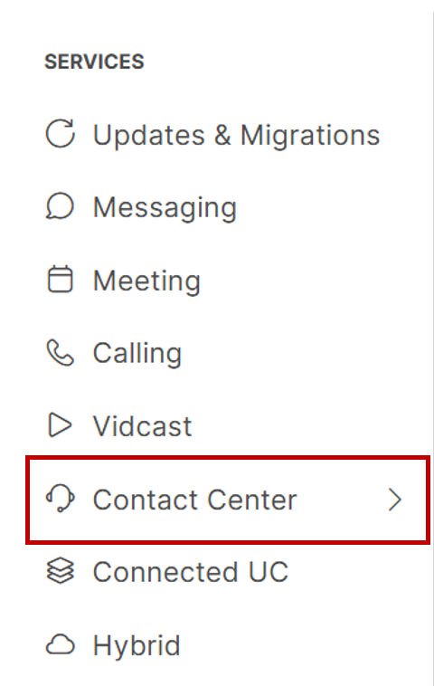{ width="200" }

- In the Contact Center navigation pane, under Customer Experience, select **Queues**.

      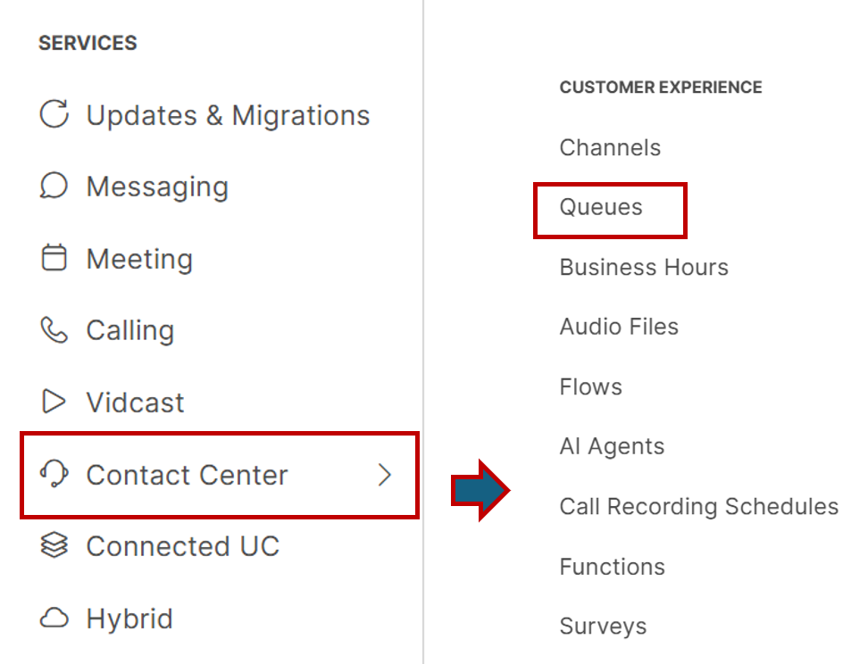{ width="400" }

- Create a new queue by clicking on the "Create a Queue" option.

- The Queue Creation Wizard will appear. Provide the following details:

      - **General**
           - **Name**: [Provide a descriptive name for your queue]
           - **Contact direction**: Outdial Queue
           - **Channel type**: Telephony

      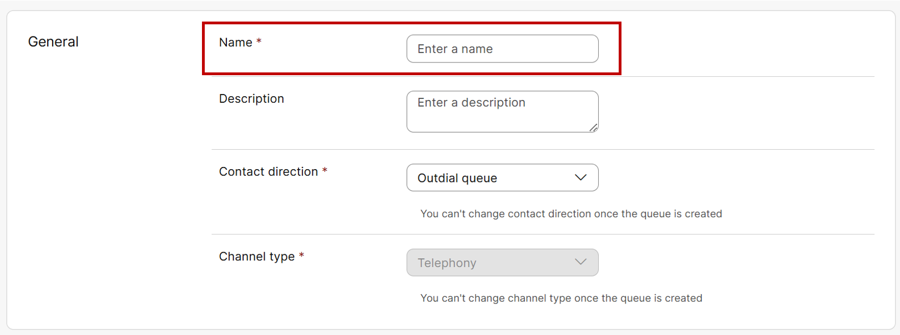{ width="800" }

      - **Contact Routing Settings**
           - **AgentAssignment**: Teams
           - **Routing Pattern**: Longest available
           - **Call Distribution**: Create a group and add the team **WebeOne_Team_[num]**

      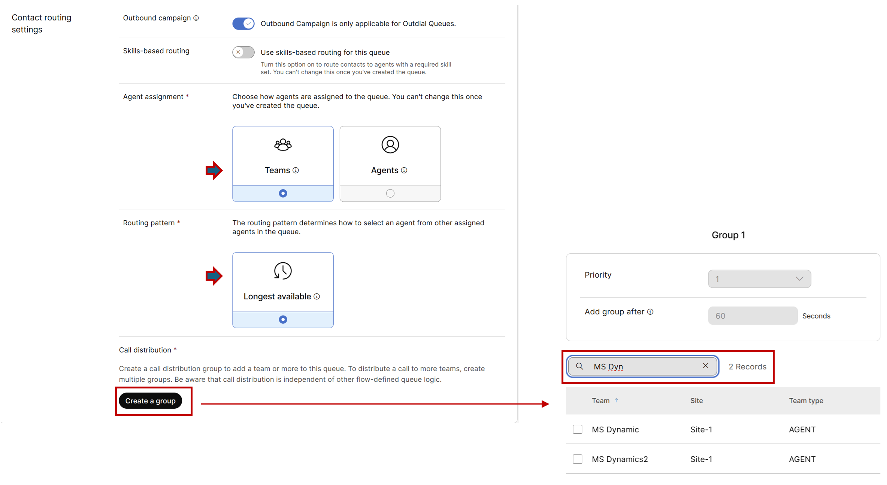{ width="700" }

      - **Advanced Settings**
           - **Service level threshold**: 30 seconds
           - **Maximum time in queue**: 30 seconds
           - **Default music in queue**: defaultmusic_on_hold.wav

      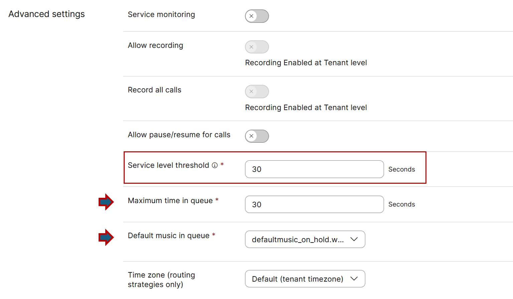{ width="700" }

- Once these settings are added, click Create to finalize the queue.

- Lets create a Entry point to map the queue to this entry point. 

- Navigate back to Customer Experience in Contact Center and click on **Channels**.

      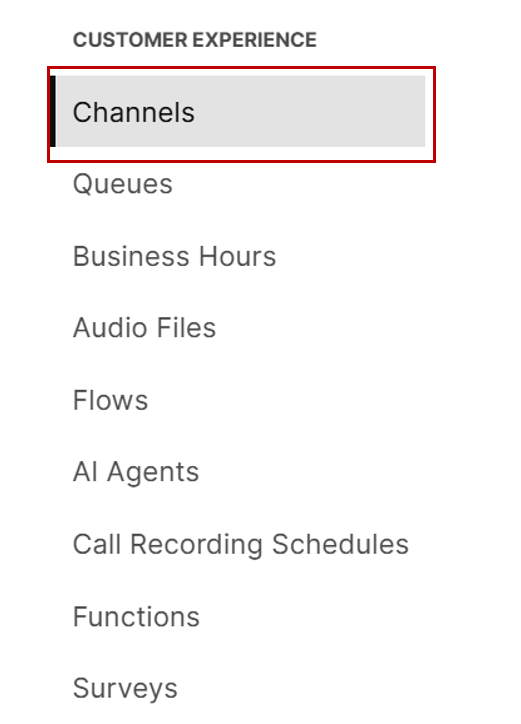{ width="200" }

- Create a new channel by clicking on the "Create a channel" option.

      { width="180" }

- The Channel Creation Wizard will appear. Provide the following details:

      - **Name**: [Provide a descriptive name for your channel]
      - **Channel type**: Outbound Telephony
      - **Service level threshold**: 30 seconds
      - **Timezone**: America/New York

      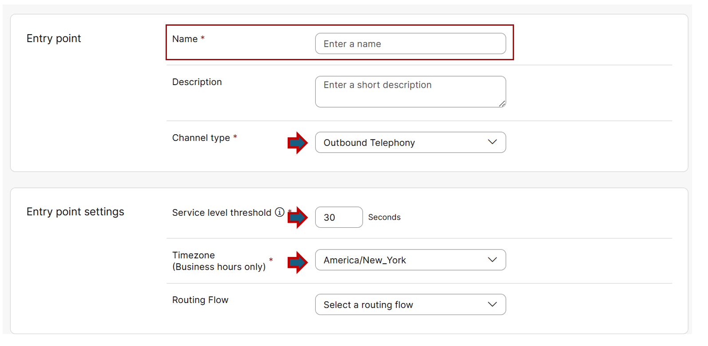{ width="750" }

- After these settings are added, click Create to finalize the channel.

- Since outdial is an agent activity, the Agent Desktop should have the capability to call any number outside the WxCC ecosystem. 

- To enable this capability, create an agent profile and map it to the agent.

- Navigate to Desktop Experience in Contact Center and click on **Desktop Profiles**.

      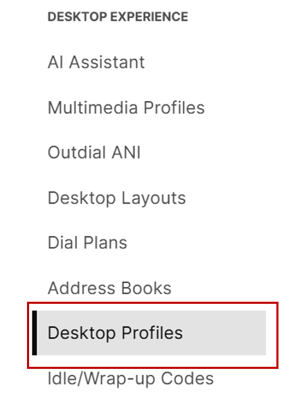{ width="200" }

- In Desktop Profiles, create a new profile by clicking on "Create Desktop Profile".

      { width="200" }

- In the General section, provide the desired name for your profile.

      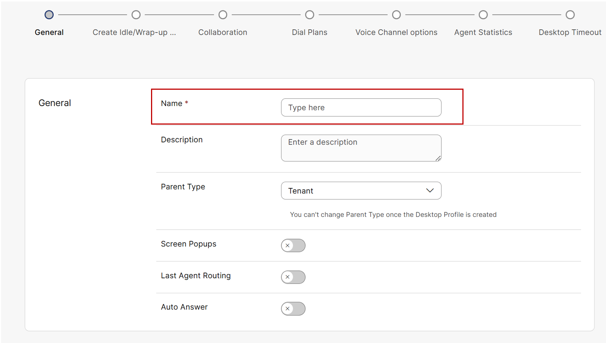{ width="700" }

- Move to "Dial Plans" by clicking Next button (at the bottom of the screen) a couple of times.

- Enable "**Outdial**".
      - Select the newly create entrypoint as an "**Outdial Entry Point**".
      - Select the preconfigured address book "**WebexOne_outdial_AddressBook**" as an "**Address Book**".

      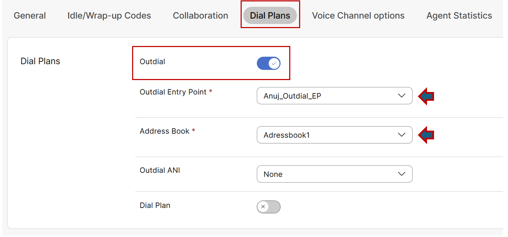{ width="700" }

- Move to "Voice Channel Options" by clicking Next and ensure that "Desktop" is enabled under "Voice Channels options".

      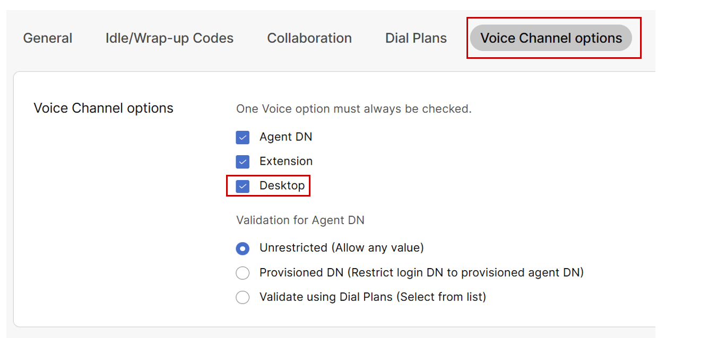{ width="700" }

- Proceed to the end of desktop profile creation by clicking Next and finally Create.

- Now, Navigate to the User Management section in Contact Center and click on **Contact Center Users**.

- Bring up your user and assign the newly created desktop profile under "Desktop Profile" and Save changes.

      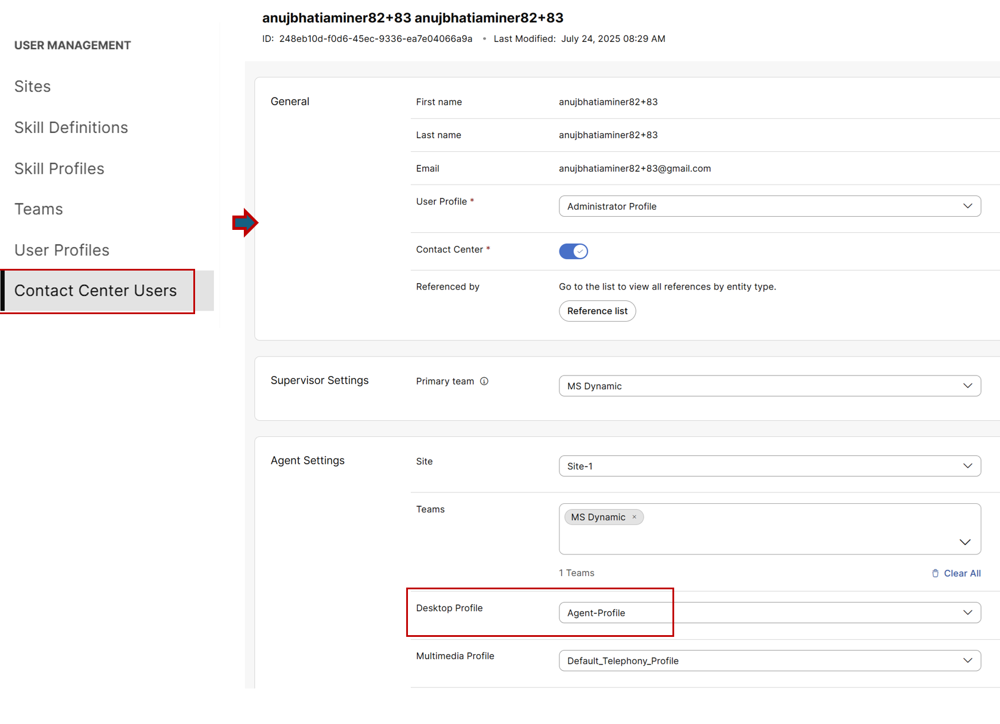{ width="800" }

## Section 2 : Test Outdial 

- Now, log in to the Agent Desktop using the provided credentials.
      - **URL**: https://desktop.wxcc-us1.cisco.com/
      - **Username**: Contact the lab proctor if information is unavailable.
      - **Password**: Contact the lab proctor if information is unavailable.

- Please select desktop as telephony option and set the Team as **WebexOne_Team_[num]** and login.

      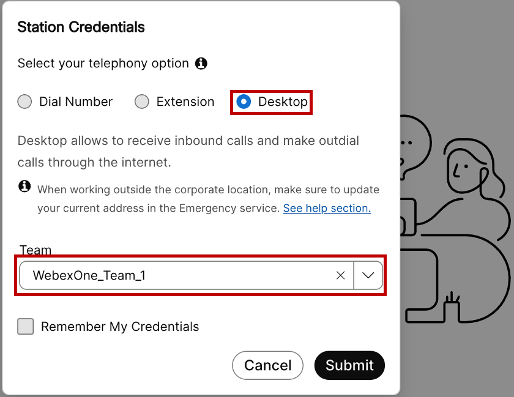{ width="400" }

- Present task is to dial your cell phone number. 

- First, click the Outdial Call option on the top right corner of the desktop. 

      { width="300" }

- You'll notice that the dial pad is missing; the only available option is to search by name, email, or number within the tenant. 

      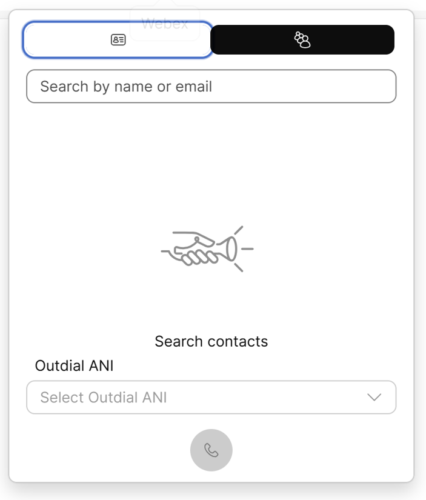{ width="300" }

- This prevents us from dialing an individual cell phone number directly. 

- To fix this, we need to find where the dial pad setting is controlled. 

- Since this is an agent desktop function, we'll check the agent's desktop profile and the dial plan where we enabled the outdial option.

- In Control Hub, go back to the Desktop Profile section. 

- Select the profile that's mapped to the agent you are working with.

- Navigate to the Dial Plans tab. 

- Enable the dial plan functionality and select US as the dial plan. Then, click Save.

      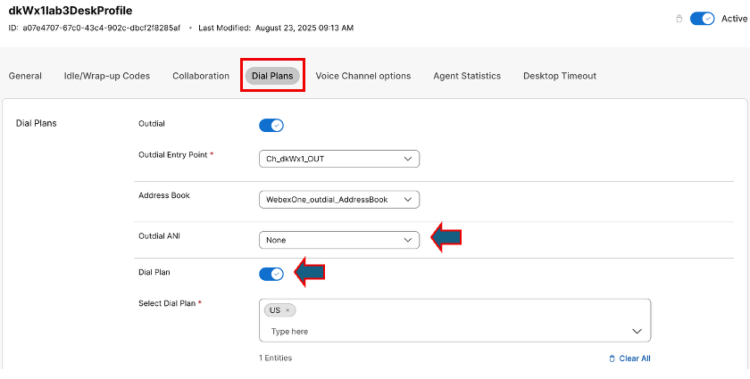{ width="800" }

- Refresh the Agent Desktop application browser. 

- Click the Outdial option again.

- You should now see the number pad pop up, allowing you to punch in numbers.

- Enter your cell phone number. You may add a "1" before the number, or it will work without it 

- Click the Dial button.

      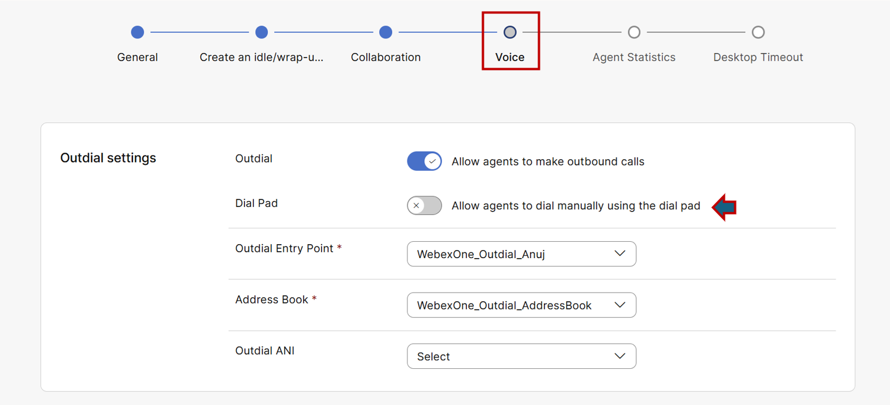{ width="400" }

- You should ideally see an agent-initiated call to the cell phone number, but nothing happens.

## Section 3 : Troubleshoot Outdial Failure

- Let's troubleshoot to see why this is the case. 

- To figure this out, bring up the browser developer tool (Windows Shortcut: Press F12 Key)

      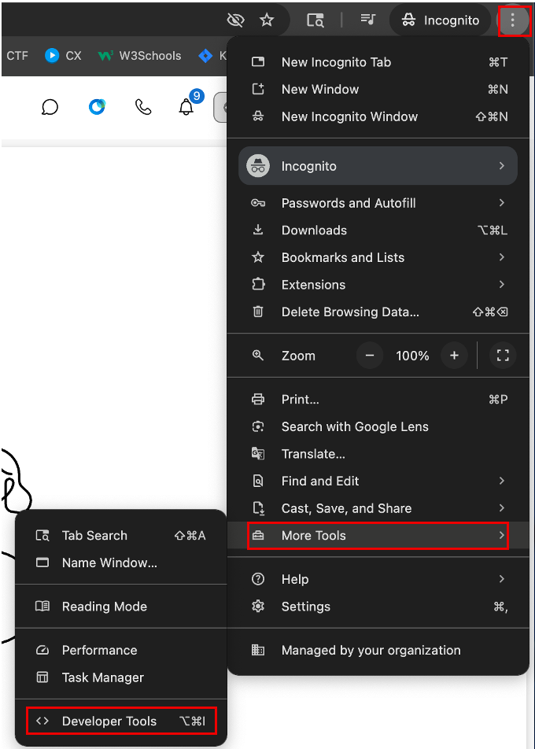{ width="500" }

- Once the developer tool is up, ensure that it's on the "Console" tab and clear the console logs by selecting the "Clear Console" button 

      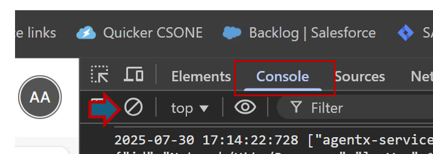{ width="500" }

- Using the dial pad, dial the cell phone number again.

- As soon as the call fails, you should see a red error message in the console logs with the message **event=OutdialFailed**

      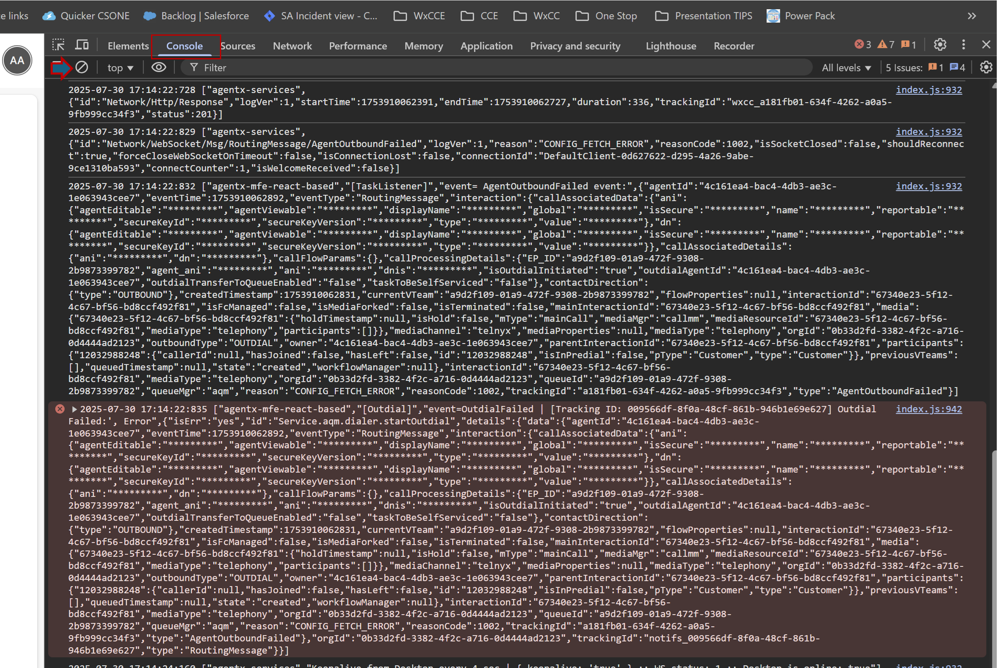{ width="700" }

- Now, let's look closer into the failure message and figure out what the issue might be.

- For ease, one can copy the error message into a Notepad or Notepad++ application.

- Search for "error," and at the bottom of the error message, you will notice there is a fetch error on "**Config**" – "**Config_fetch_error**." The exact config it's talking about is "**queuemgr**" which basically means queue.

      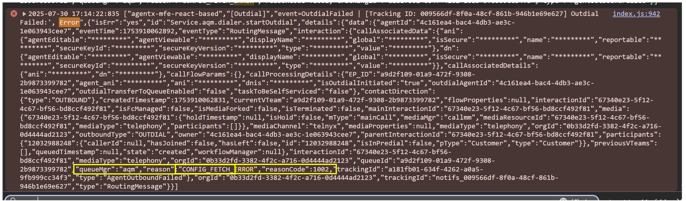{ width="800" } { width="400" }

- This overall means the system is not able to fetch the team details from the queue perspective where agent resides. 

- In WxCC, a queue is always mapped to an entry point via routing flows, so let's go back to the Entry Point for outdial and check the configuration again.

- Via Control Hub, under "Customer Experience," go back via "Channel" to the Outdial Entry Point that was configured.

      { width="200" }

- Under "Entry Point Settings," you will notice that there is no routing flow mapped.

- From the dropdown, select the flow "**WebexOne_OutdialUser[num]_Flow**" and fill in these fields:
      - Music on hold: "defaultmusic_on_hold"
      - Version label: Latest
      - Outdial Queue: Select the queue that was created in step 1 of your initial setup.

      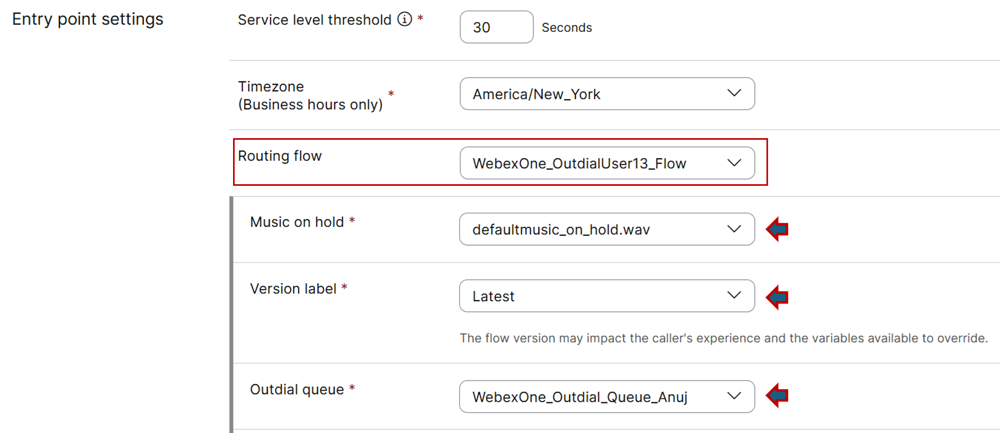{ width="800" }

- Save the settings.

- Refresh the Agent Desktop browser and perform the outdial to the cell phone number; the call should now be successful.

- If you observe the browser debug console logs, you should see a message that will clearly show case its fetching the config and have the team details via the queue ID.

## Section 4 : Custom Outdial ANI 

- In many cases, business requirements dictate that the Outdial ANI displayed on customer devices should be set to a specific toll-free or departmental number.

- Here, the outdial ANI noticed on the cell phone is "**+19842906065**" which is the default configuration set on the tenant level.

- To, review the Tenant-Level Outdial ANI setting in tenant Settings navigate to the Voice tab and note the existing Outdial ANI which is "**+19842906065**".

      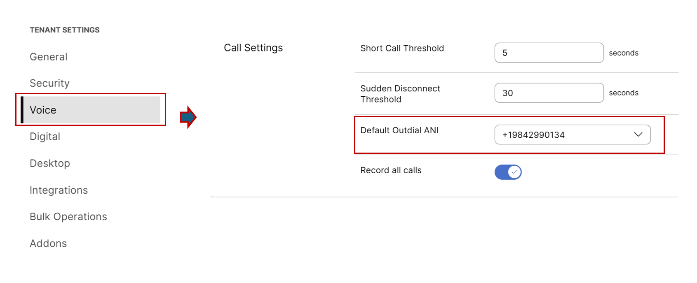{ width="700" }

- To change to a custom ANI, administrator can create there own outdial ANI.

- For ease here outdial ANI has already been pre-configured and to review in Desktop Experience, go to Outdial ANI settings.

      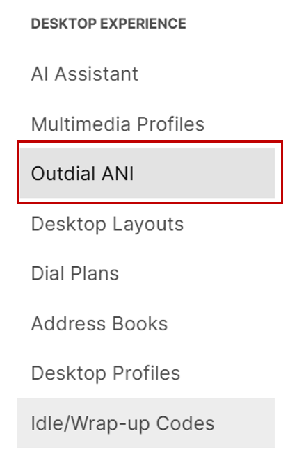{ width="200" }

- Select **WebexOne_Outdial_ANI**.

      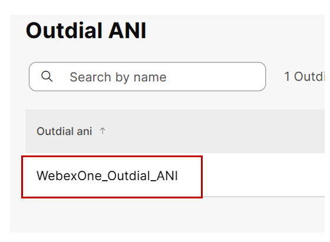{ width="300" }

- Confirm that it is mapped to the number "**+19842906070**".

      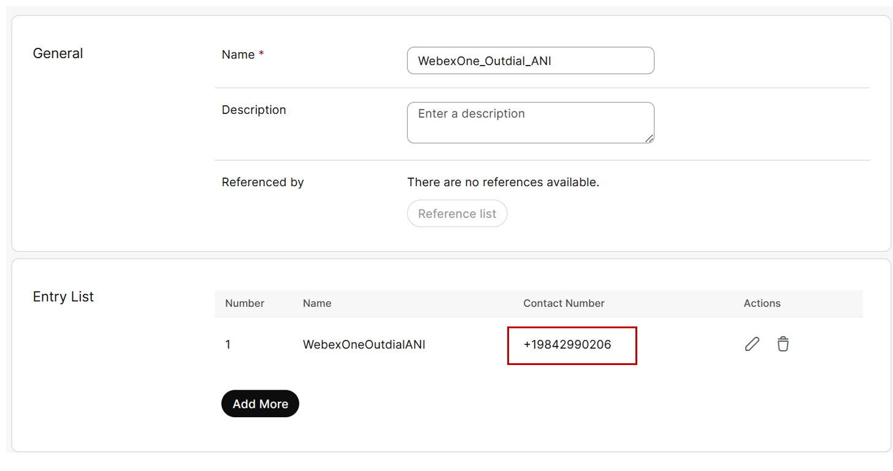{ width="700" }

- A custom Outdial ANI allows an agent to select the ANI on the desktop during an outdial call, provided the agent’s desktop profile is mapped to the new Outdial ANI.

- To check in Desktop Experience, open the configured Agent Desktop Profile.

- Navigate to the Dial Plans section.

- In the Outdial ANI field, select **WebexOne_Outdial_ANI** and save your changes.

      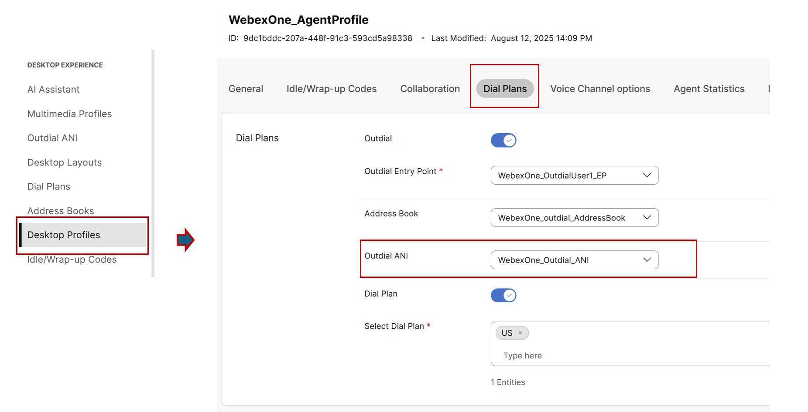{ width="700" }

- Now, Perform an Outdial Call Using the Custom ANI.

- Log in or refresh the agent desktop.

- Initiate an outdial call.

- Verify on the recipient’s device that the displayed ANI is the custom number.

**Congratulations !!** on completing this exercise! 

You've not only set up the outdial feature from scratch but also learned how to identify and fix common errors, ensuring your deployments are both functional and reliable.

