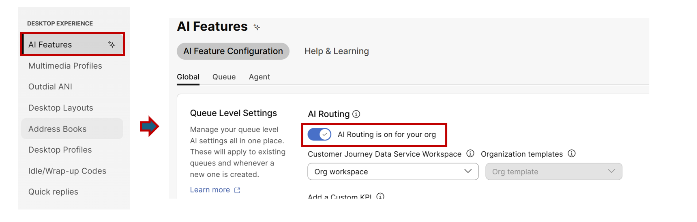
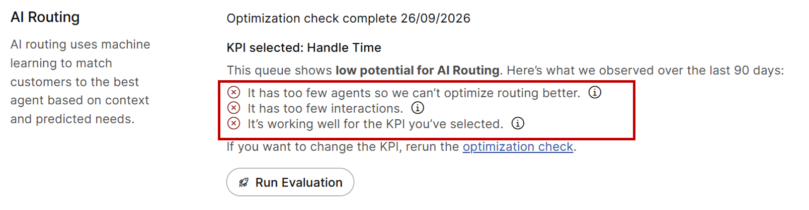
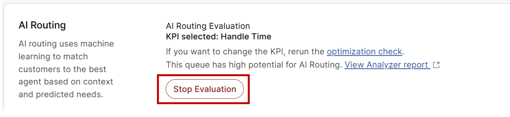

# Lab 5 -  Personalized AI Routing 

Please use the following credentials to connect to Control Hub and configure Webex Contact Center:

| <!-- -->         | <!-- -->         |
| ---------------- | ---------------- |
| `Control Hub URL`            | <a href="https://admin.webex.com" target="_blank">https://admin.webex.com</a> |
| `Username`       | labuser**ID**@wx1.wbx.ai _(where **ID** is your assigned pod number; this ID will be provided by your proctor)_ |
| `Password`       | webexONE1! |

## Objective 

Traditional contact center routing relies on static, rigid skill assignments that often lead to misrouted contacts, higher average handle times (AHT), and administrative overhead. In this lab module, we will learn how to configure and leverage Webex Contact Center Personalized AI Routing. 

By completing this module, prticipants will be able to:

- **Understand the Core Value**: Learn how multi-dimensional AI dynamic matchmaking optimizes routing based on operational metrics like Handle Time.

- **Review Global Configuration**: Review AI Routing at the organization level and Perform bulk Optimization Checks and initiate Evaluation Mode (Shadow Mode).

- **Learn the Concept of Shadow Mode**: Learn how AI models predict handle-time reductions without altering live call flows.

- **Analyze Predictive Performance**: Review AI handle-time prediction models in analyzer against baseline queue historical performance.

Note: Because this lab environment does not feature active live call traffic an existing pre-populated queue **WebexOne_SkillQueueFlow** has been provided to explore confguration and performance dashboards.

## Section 1 : Review Org-Level Enablement Setting 

- Log in to Control Hub as an Administrator.

- Navigate to Services > Contact Center.

- Under Desktop Experience, select AI Features.

- Open the AI Routing configuration page.

- Ensure that the Organization-level AI Routing switch is set to ON.

- Enabling this feature globally makes it available across the org, but does NOT automatically change routing logic.

### Section 2: Queue Optimization & Evaluation Mode Setup

- Select the Queues tab on the AI Routing page.

- Select the queue created in the previous Skill-Based Routing lab: WebexOne_SBR_Queue_[name]

- Click Run Optimization Check.

- In the KPI selection section, choose the stock metric Handle Time.

- Click Next, then click Run Optimization Check.

- Observe the validation results: The system evaluates whether the queue has sufficient agent density, interaction volume, and potential optimization gain for your chosen KPI.

- In our lab setup, the check will indicate low potential because the queue lacks sufficient agent density and call volume.

- Regardless of the low potential result, click Evaluation Mode.

- Confirm the prompt to start shadow execution.

- Now, In Evaluation Mode, incoming calls to this flow continue to follow standard routing logic. Meanwhile, the AI engine operates in the background to generate handle-time optimization predictions.

### Section 3: Reviewing a Completed Evaluation Queue

- Navigate back to the Queues tab under AI Features.

- In the search/filter bar, enter the queue name: **WebexOne_SkillQueueFlow**

- Click on **WebexOne_SkillQueueFlow** to open its detailed AI Routing configuration pane.

- We should see the setting **Apply AI Routing** is enabled

- However, take a look at the screenshot below to see the steps required to apply AI Routing after Evaluation Mode completes in 5 days. 

      { width="200" }

- Review the queue status section in it before the toggle switch to apply AI Routing was enabled: 
	- **KPI Selected**: Handle Time
	- **Potential**: This queue has high potential for AI Routing and offers analyzer report to review. 
	- **Analyzer Link**: Analyzer report which highlgihts how AI routing is behaving.

- The toggle  Blue indicates that Live AI Routing is now active for this queue, and real-time contacts will now be routed dynamically using the trained AI mode.

### Section 4: Reporting & Analytics Concepts

- Evaluation Mode generates a comparative dashboard that maps actual handle-time metrics against AI-predicted performance.

- Lets review the report for the Queue **WebexOne_SBR_Queue_[name]** Where you have enabled the evualation Mode. 

- Navigate to Services > Contact Center > Desktop Experience > AI Features.

- Select the Queues tab and locate the queue you configured **WebexOne_SBR_Queue_[name]**.

- Click on the queue to open its AI Routing details pane.

- Locate the Potential status section and click the link: **View Analyzer report**.

- This will automatically open Webex Analyzer in a new browser tab with the report filtered for your queue.

- However, all metric tiles will display 0 or 00:00:00, and the charts will show "No data available to render the visualization."

      { width="500" }

- This is expected because our lab queue has processed minimal or no live calls during the evaluation window.

- In a live environment, these metrics populate continuously over the 5-day shadow evaluation period.

- To understand how to evaluate AI Routing performance in a real-world deployment, refer to the pre-populated production report screenshot below:

      { width="500" }

Key Metrics to Examine in the Dashboard:

- **Total Interactions**: The overall volume of contacts routed through standard queue logic during the evaluation period (e.g., 24).

- **Total Interactions with Predictions**: The subset of interactions where the AI model successfully generated an agent match prediction (e.g., 15).

- **Average Handle Time (Actual)**: The actual historical baseline handle time recorded for calls handled via standard routing (e.g., 00:05:31 / 5 min 31 sec).

- **Average Handle Time (Predicted)**: The handle time the AI engine predicts would have been achieved if contacts had been routed to the AI's recommended agents (e.g., 00:03:10 / 3 min 10 sec).

- **Average Handle Time Actual vs. Predicted KPI Chart**: A visual comparison comparing actual handling duration against predicted outcomes over time.

- The Go-Live administrators can use the comparative metrics in this report to make a data-driven decision 

- In this example because the predicted handle time (3m 10s) shows a significant reduction compared to the actual handle time (5m 31s), the administrator can confidently return to Control Hub and enable Apply AI Routing for the queue!

**Congratulations!!** You have successfully completed this hands-on lab module on Webex Contact Center Personalized AI Routing.
